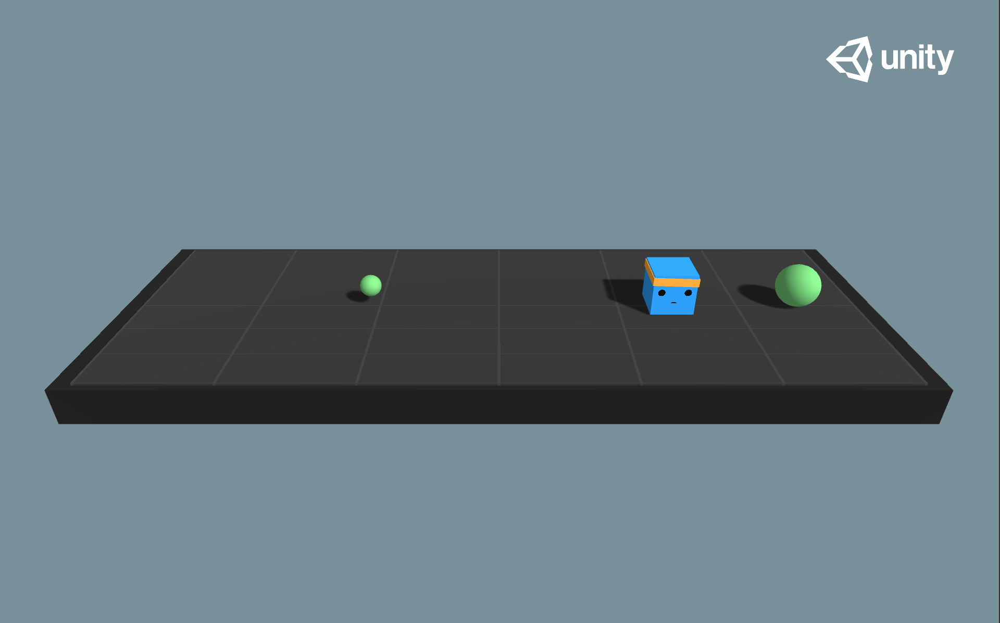

# MLAgents-Google-Collab
Updated versions of ML Agent notebooks , good place for starters. A Rainbow DQN implemented along side with n-step bootstrapping for best performance.

### Rainbow DQN with ML Unity Agents
Features
## PrioritizedReplayBuffer
    Attributes:
        max_priority (float): max priority
        tree_ptr (int): next index of tree
        alpha (float): alpha parameter for prioritized replay buffer
        sum_tree (SumSegmentTree): sum tree for prior
        min_tree (MinSegmentTree): min tree for min prior to get max weight
## Noisy Linear Networks
    Attributes:
        in_features (int): input size of linear module
        out_features (int): output size of linear module
        std_init (float): initial std value
        weight_mu (nn.Parameter): mean value weight parameter
        weight_sigma (nn.Parameter): std value weight parameter
        bias_mu (nn.Parameter): mean value bias parameter
        bias_sigma (nn.Parameter): std value bias parameter
## Categorical DQN
## N Step Learning
## Segment Tree Structure
## Advantage Function
## Open AI GYM like wrapper

Notice : Train is just 10 000 samples for test purpose. It can reach 0.9 benchmark value.

## Basic Env details

    Set-up: A linear movement task where the agent must move left or right to rewarding states.
    Goal: Move to the most reward state.
    Agents: The environment contains one agent.
    Agent Reward Function:
    -0.01 at each step
    +0.1 for arriving at suboptimal state.
    +1.0 for arriving at optimal state.
    Behavior Parameters:
    Vector Observation space: One variable corresponding to current state.
    Vector Action space: (Discrete) Two possible actions (Move left, move right).
    Visual Observations: None
    Float Properties: None
    Benchmark Mean Reward: 0.93

In order to use it on local PC , you have to change strings.
Both builds are updated version of SDK , can swap easily.

## Will do
# More docs
# PPO & DD4G/DDPG 
# Multi agent example